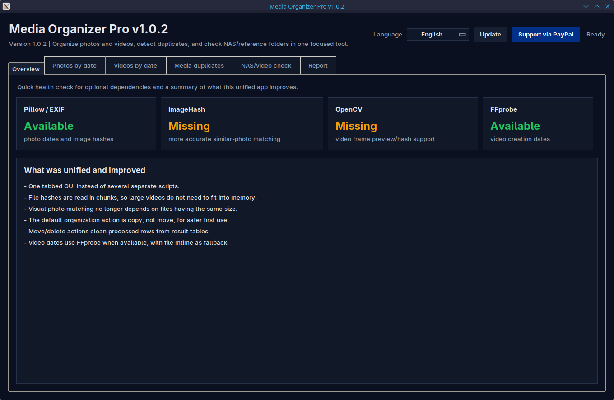

# Media Organizer Pro

Media Organizer Pro is a desktop GUI tool for organizing photo and video
archives, detecting duplicate media, and comparing videos against reference or
NAS folders.

The application source is in `media_organizer_pro/`.

## Screenshot

### Main window



## Features

- Organize photos by EXIF date or file date.
- Organize videos by FFprobe creation metadata or file date.
- Find exact image/video duplicates with SHA-256.
- Find visually similar images with perceptual hashing.
- Optionally compare video frame hashes.
- Compare videos against reference/NAS folders by name or SHA-256.
- English UI by default, with a Croatian language switch.
- PayPal support button linked to `https://paypal.me/danijel0304`.

## Run From Source

On Linux or macOS:

```bash
./run_media_organizer_pro.sh
```

On Windows, double-click `run_media_organizer_pro.bat`.

You can also run it manually:

```bash
cd media_organizer_pro
python3 media_organizer_pro.py
```

Install optional dependencies for full functionality:

```bash
pip install -r media_organizer_pro/requirements.txt
```

For video metadata, install FFmpeg/FFprobe on your system.

## Builds

GitHub Actions builds release artifacts:

- Windows `.exe`
- Linux `.tar.gz`
- Linux `.deb`
- Linux `.AppImage`

Create or run the release workflow with a version tag such as `v1.0.0`.
